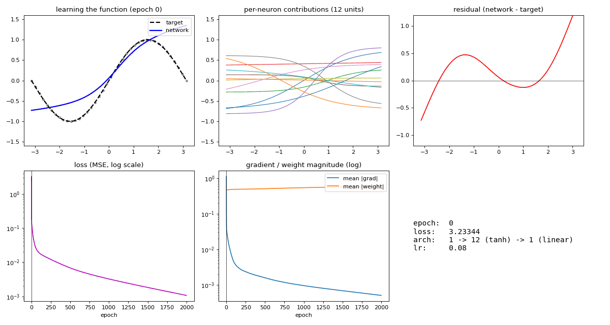
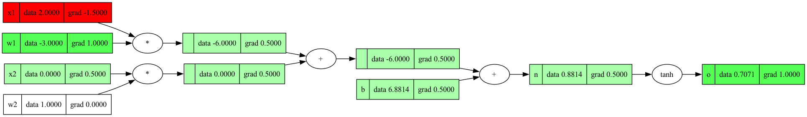
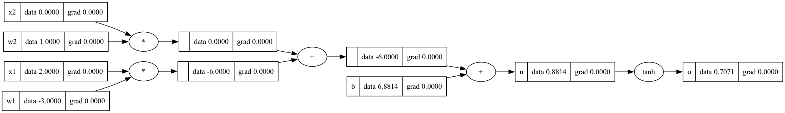
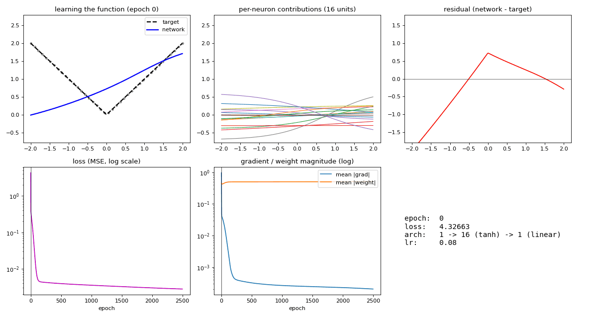
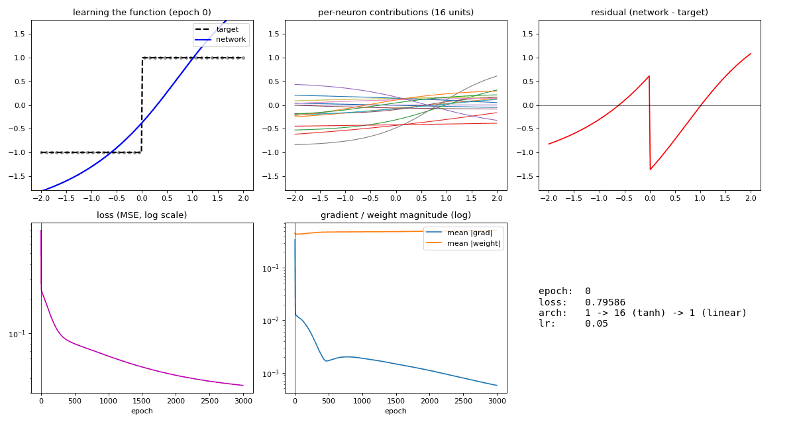
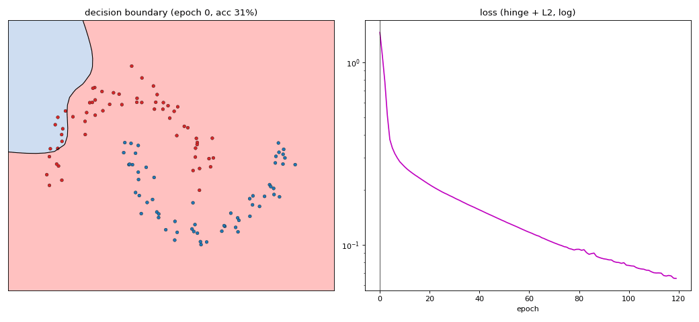
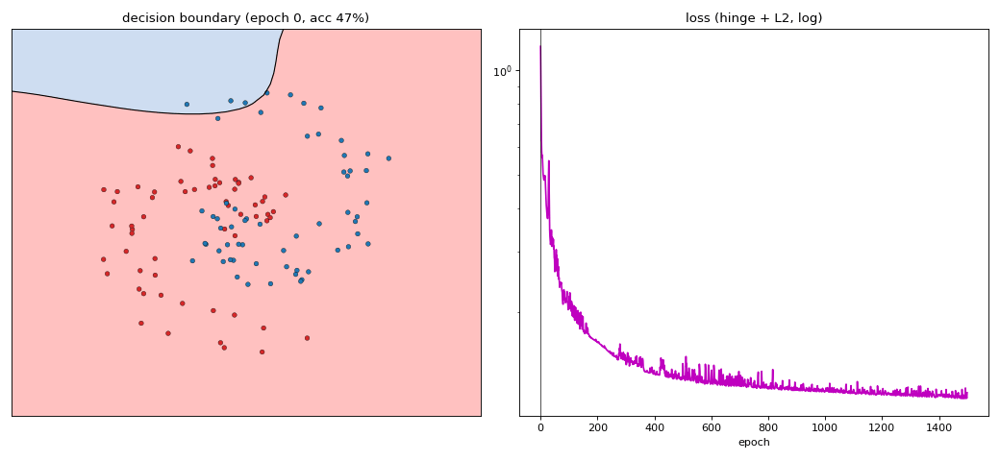

# micrograd

My from-scratch implementation of a scalar **autograd engine** with backprop, a tiny neural-net library on top of it, and the part that makes it my own: **you can watch it work.** It animates gradients flowing through the computation graph, and animates a network learning a function in real time.

A take on [Andrej Karpathy's micrograd](https://github.com/karpathy/micrograd), extended with gradient visualizations, a training dashboard, a CLI, and verification against **PyTorch and JAX**.



---

## Why this exists

PyTorch and JAX are faster than this will ever be. The point of micrograd isn't speed, it's **transparency**: every value carries its own `data` and `grad`, and the whole computation graph is right there to draw and step through. PyTorch hides all of that inside compiled kernels. So this project leans entirely into the one thing a tiny scalar engine does better than the giants, **making the mechanism visible**:

- **Watch backprop happen** — step through the backward pass one node at a time and see gradients propagate from the output back to the inputs.
- **Watch a network learn** — train an MLP on `sin(x)` and watch the prediction snap into shape, alongside the per-neuron decomposition, loss curve, and gradient health.
- **Watch a boundary form** — train a classifier on moons / spirals and watch the decision boundary curl into place.

Everything is verified against PyTorch and JAX so the gradients are provably correct, not just plausible.

---

## The engine

`Value` is a scalar that records the operation that created it, so the graph can be walked backward. It supports `+ - * / **`, `tanh`, `exp`, `log`, `ReLu`, `abs`, and the reverse operators, each with a hand-written local gradient.

```python
from micrograd import Value

a = Value(-4.0)
b = Value(2.0)
c = a + b
d = a * b + b**3
c += c + 1
c += 1 + c + (-a)
d += d * 2 + (b + a).ReLu()
d += 3 * d + (b - a).ReLu()
e = c - d
f = e**2
g = f / 2.0
g += 10.0 / f          # reverse division

print(f"{g.data:.4f}")  # forward pass
g.backward()
print(f"{a.grad:.4f}")  # dg/da via backprop
print(f"{b.grad:.4f}")  # dg/db via backprop
```

Every gradient here matches PyTorch to within `1e-6` (see [the tests](tests/test_engine.py)).

### Visualizing the graph

`draw_dot` renders the graph with each node colored by its gradient (green positive, red negative, deeper = larger, white = zero):



And `animate_backward` replays the backward pass one node at a time, so you watch the gradients spread from the output back to the inputs:



See [`examples/mechanism.ipynb`](examples/mechanism.ipynb).

---

## The neural net

A minimal PyTorch-like API: `Neuron`, `Layer`, `MLP`, all subclassing `Module` (which provides `parameters()` and `zero_grad()`). Hidden layers use `tanh`; the output layer is linear, which is what makes regression work.

```python
from micrograd import MLP

net = MLP(1, [12, 1])     # 1 -> 12 (tanh) -> 1 (linear)
print(len(net.parameters()))
```

### Watch it learn a function

`learn.fit_function` trains an MLP to approximate a 1-D function and records a full dashboard: the prediction vs. target, the **per-neuron decomposition** (how the tanh units sum into the function, the visual "aha" of universal approximation), the residual, the loss curve, and gradient/weight magnitudes. See the GIF at the top, and [`examples/learning.ipynb`](examples/learning.ipynb).

The 1-D gallery doubles as a lesson in what a smooth tanh net can and can't do:

| smooth (great) | corner (small error) | discontinuity (it rings) |
|---|---|---|
|  |  |  |

### Watch a decision boundary form

`classify.fit_classifier` trains a 2-D classifier with a max-margin (SVM) loss and animates the boundary:

| moons | spiral |
|---|---|
|  |  |

---

## CLI

Train any task on the micrograd engine (with optional animation), or on PyTorch / JAX for comparison:

```bash
python -m micrograd.cli --list                              # show tasks and losses
python -m micrograd.cli --task sin --gif out.gif            # train + animate on micrograd
python -m micrograd.cli --task moons --loss svm --gif m.gif # Karpathy's max-margin loss
python -m micrograd.cli --task spiral --framework pytorch   # same task, on PyTorch
python -m micrograd.cli --task sin --framework jax --lr 0.05
```

Everything is configurable:

- **tasks** — regression: `sin`, `abs`, `quad`, `step`, `damped`; classification: `moons`, `spiral`
- **losses** — regression: `mse`, `mae`, `huber`; classification: `hinge`/`svm`/`max_margin`, `squared_hinge`, `logistic`
- **knobs** — `--lr` (step size), `--epochs`, `--hidden 16,16`, `--alpha` (L2), `--seed`, `--noise`
- **engines** — `--framework micrograd | pytorch | jax` (animation is micrograd-only)

---

## Verified against PyTorch and JAX

Two layers of checks ([`tests/`](tests/), run with `pytest`):

- **`test_engine.py`** — individual ops (`+ * ** tanh exp log ReLu abs` and reverse ops) match PyTorch gradients.
- **`test_frameworks.py`** — a full MLP's forward output and *every* parameter gradient match both PyTorch and JAX exactly (fixed weights, so the comparison is deterministic).

All 6 tests pass. Beyond correctness, [`benchmark.py`](benchmark.py) trains the same task on all three engines and writes [`BENCHMARKS.md`](BENCHMARKS.md). The metrics agree; the wall-clock shows why nobody trains on a scalar engine:

| task | engine | metric | speedup |
|---|---|---|---|
| sin (MSE) | micrograd / pytorch / jax | ~0.003 (all agree) | 1x / 6x / 8x |
| moons (acc) | micrograd / pytorch / jax | 99% / 100% / 99% | 1x / 2520x / 97x |

---

## Setup

The core engine is pure Python. The demos, tests, and comparisons need a few extras:

```bash
pip install -e .                 # installs the package (then `import micrograd` works anywhere)
pip install -r requirements.txt  # matplotlib, pillow, graphviz, torch, jax, pytest

# graphviz also needs the system binary:
brew install graphviz            # macOS
```

Then:

```bash
pytest                                   # run the tests
python benchmark.py                      # regenerate BENCHMARKS.md
python -m micrograd.cli --task sin       # train something
```

---

## Project layout

```
micrograd/
  micrograd/
    engine.py       Value: the scalar autograd engine
    nn.py           Module / Neuron / Layer / MLP
    viz.py          graph drawing + backward-pass animation
    learn.py        1-D function fitting + training dashboard
    classify.py     2-D classifiers (moons / spiral) + boundary animation
    frameworks.py   PyTorch + JAX training, for comparison
    cli.py          command-line interface
  examples/         mechanism.ipynb, learning.ipynb
  tests/            test_engine.py, test_frameworks.py
  benchmark.py      BENCHMARKS.md generator
  reference.ipynb   my original notebook from the Karpathy walkthrough
```

---

## Credits

Inspired by [Andrej Karpathy's micrograd](https://github.com/karpathy/micrograd) and his [neural networks: zero to hero](https://karpathy.ai/zero-to-hero.html) series. The engine and the moons demo follow his design; the visualizations, training dashboard, 1-D/classification galleries, CLI, and PyTorch/JAX verification are my additions.

## License

[MIT](LICENSE)
