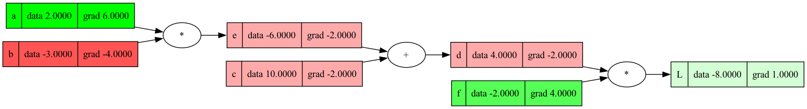
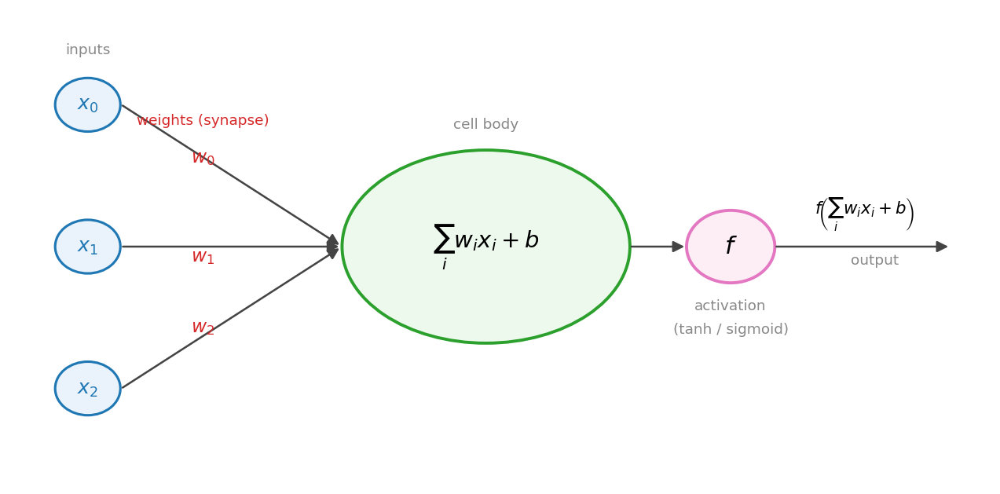
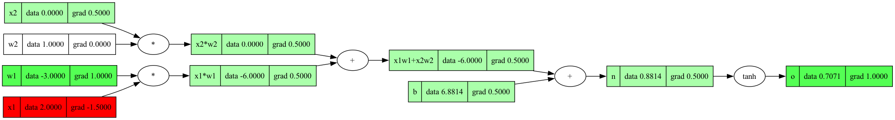

# Lecture 1: micrograd

Notes from Karpathy's "The spelled-out intro to neural networks and backpropagation: building micrograd." What backprop is, how to build a scalar autograd engine, and a small neural-net library on top of it.

## Backpropagation

Backprop efficiently evaluates the gradient of a loss function with respect to the weights of a network. The gradient says how each weight affects the loss, so you can iteratively tune the weights to minimize the loss and improve accuracy.

## micrograd: expressions as graphs

micrograd builds up a math expression and keeps pointers between the nodes that produced it.

```python
a = Value(-4.0)
b = Value(2.0)
c = a + b
```

Because micrograd records that $c = a + b$, it can later compute $\frac{dc}{da}$ and $\frac{dc}{db}$. Each `Value` stores which values it came from and which operation made it, so the whole expression is a graph. Think of it as a tree (many nodes flow into one output), not a linked list.

`node.backward()` recursively applies the chain rule: it computes the derivative of the output with respect to every intermediate node and every input (the leaves, like `a` and `b`).

micrograd works on individual scalars instead of vectors or tensors. That keeps the mechanics visible. Real libraries use tensors for speed.

Plan for the lecture: build micrograd in a notebook, then split the engine into its own file and build a neural-net library (Neuron, Layer, MLP) on top.

## Derivatives from first principles

The derivative is the limit of the change in the function over the change in the input:

$$ \frac{df}{dx} = \lim_{h \to 0} \frac{f(x+h) - f(x)}{h} $$

Worked example with $f(x) = x^2$:

$$ \frac{(x+h)^2 - x^2}{h} = \frac{x^2 + 2xh + h^2 - x^2}{h} = \frac{2xh + h^2}{h} = \frac{h(2x+h)}{h} = 2x + h $$

Taking $h \to 0$ gives $f'(x) = 2x$.

Numerical caveat: if you approximate the derivative on a computer with a finite $h$, making $h$ too small eventually gives a wrong answer because of floating-point arithmetic.

## Manual backprop, example 1

$$ a=2,\quad b=-3,\quad c=10,\quad e = a\cdot b,\quad d = e + c,\quad f = -2,\quad L = d \cdot f $$

Forward values: $e = -6$, $d = 4$, $L = -8$.

Work backward from $L$, multiplying local derivatives:

- $\dfrac{\partial L}{\partial L} = 1$
- $L = d\cdot f$, so $\dfrac{\partial L}{\partial d} = f = -2$ and $\dfrac{\partial L}{\partial f} = d = 4$
- $d = e + c$, so $\dfrac{\partial d}{\partial e} = \dfrac{\partial d}{\partial c} = 1$, giving

$$ \frac{\partial L}{\partial e} = \frac{\partial L}{\partial d}\frac{\partial d}{\partial e} = (-2)(1) = -2, \qquad \frac{\partial L}{\partial c} = (-2)(1) = -2 $$

- $e = a\cdot b$, so $\dfrac{\partial e}{\partial a} = b = -3$ and $\dfrac{\partial e}{\partial b} = a = 2$, giving

$$ \frac{\partial L}{\partial a} = \frac{\partial L}{\partial e}\frac{\partial e}{\partial a} = (-2)(-3) = 6, \qquad \frac{\partial L}{\partial b} = (-2)(2) = -4 $$

The chain rule is just multiplying the local rates of change as you move backward: for $h(x) = f(g(x))$, $h'(x) = f'(g(x))\,g'(x)$.

The same graph, drawn by micrograd with forward values and the gradients filled in by `backward()`:



## A single neuron

Math model: inputs $x_i$ arrive along axons, each scaled by a weight $w_i$ (the synapse). The cell body sums the weighted inputs, adds a bias, then applies an activation function:

$$ o = f\!\left(\sum_i w_i x_i + b\right) $$

The activation $f$ is usually a squashing function like sigmoid or tanh.



Example with tanh:

- inputs $x_1 = 2,\; x_2 = 0$
- weights $w_1 = -3,\; w_2 = 1$
- bias $b \approx 6.8814$ (Karpathy picks it so the output lands on a round number)

The weighted inputs are summed (not multiplied together):

$$ x_1 w_1 = -6, \qquad x_2 w_2 = 0 $$
$$ n = x_1 w_1 + x_2 w_2 + b = -6 + 0 + 6.8814 \approx 0.8814 $$
$$ o = \tanh(n) \approx 0.7071 $$

### tanh and its derivative

tanh is built from exponentials, so micrograd needs it as its own operation:

$$ \tanh x = \frac{\sinh x}{\cosh x} = \frac{e^{x} - e^{-x}}{e^{x} + e^{-x}} = \frac{e^{2x} - 1}{e^{2x} + 1} $$

Derivative:

$$ \frac{d}{dx}\tanh x = 1 - \tanh^2 x = \operatorname{sech}^2 x = \frac{1}{\cosh^2 x} $$

The $1 - \tanh^2 x$ form is convenient: the forward pass already computed $o = \tanh(n)$, so the local gradient is just $1 - o^2$.

## Manual backprop, example 2 (the neuron)

With $o = \tanh(n) \approx 0.7071$, so $o^2 \approx 0.5$:

$$ \frac{\partial o}{\partial n} = 1 - \tanh^2(n) = 1 - o^2 \approx 0.5 $$

Addition passes the gradient through unchanged, so every input to the sum gets $0.5$:

$$ \frac{\partial o}{\partial b} = 0.5, \qquad \frac{\partial o}{\partial (x_1 w_1)} = \frac{\partial o}{\partial (x_2 w_2)} = 0.5 $$

At a multiply node, each factor's gradient is the other factor times the downstream gradient:

$$ \frac{\partial o}{\partial w_1} = 0.5 \cdot x_1 = 1, \qquad \frac{\partial o}{\partial x_1} = 0.5 \cdot w_1 = -1.5 $$
$$ \frac{\partial o}{\partial w_2} = 0.5 \cdot x_2 = 0, \qquad \frac{\partial o}{\partial x_2} = 0.5 \cdot w_2 = 0.5 $$

Rule of thumb: the gradient on a weight is the input on the other wire times the downstream gradient.



## Implementing the engine

- Never run a node's backward until the forward pass is done. Use a topological sort: lay the graph out flat so a node only adds itself to the list after all its children are processed, then walk the list in reverse.
- Gradients must accumulate (`+=`), not overwrite. If a value feeds into more than one place, resetting would discard contributions and give the wrong gradient.
- Support constants. The operations currently assume both sides are `Value` objects and read `.data`, so wrap plain numbers to make `a + 1` work.
- `__mul__` is not commutative from Python's side, so define `__rmul__` to handle `2 * a` as well as `a * 2`.
- `exp` backward: since $\frac{d}{dx}e^x = e^x$, the local gradient is the output value itself.

  ```python
  self.grad += out.data * out.grad   # not just out.data; still chain by out.grad
  ```

- Division as a power. Implement $x^k$ for constant $k$; division is the case $k = -1$, since $a/b = a \cdot b^{-1}$. The derivative is the power rule $\frac{d}{dx}x^k = k x^{k-1}$.
- The granularity of operations does not matter, as long as each one defines a forward and a backward.
- PyTorch is micrograd for the special case of single-element tensors. It is far faster because it works on high-dimensional tensors and parallelizes.

## Loss functions and gradient descent

A loss function aggregates performance into a single number. Learning means minimizing it.

Mean squared error (MSE) is the sum of squared residuals (prediction minus target, squared).

To improve, update each parameter's data based on its contribution to the loss, moving by a small step size in the negative-gradient direction (negative because we minimize).

- Low loss means predictions match targets.
- Very low training loss with low test accuracy means overfitting.

Gradient descent loop:

1. forward pass (compute predictions and the loss)
2. backward pass (compute gradients)
3. update (nudge each parameter against its gradient)

Step size matters: too large overshoots, too small takes forever.

## Neural nets as big expressions

A neural net is one giant math expression. It takes inputs (data) and weights (parameters), runs a forward pass to a loss that measures how close predictions are to targets, then uses backprop to get every parameter's gradient and nudges them to reduce the loss. Repeating this is gradient descent.

GPT-style training uses the same idea, with stochastic gradient descent (SGD) and cross-entropy loss.

## Building the library

```
micrograd/
  __init__.py
  engine.py   # Value
  nn.py       # Neuron, Layer, MLP
```

- Activations: ReLU, sigmoid, and tanh all play the same role for MLPs.
- `nn` uses the three classes (Neuron, Layer, MLP) plus a base `Module` class with a `zero_grad` method to clear gradients between training steps.
- Test against PyTorch (the checks in Karpathy's repo), and test on small classifiers. Big examples use batching.
- Adding a new operation just means defining its forward and backward.

Loss functions mentioned:

- MSE loss
- binary cross-entropy loss
- max-margin loss

Other notes:

- L2 regularization controls overfitting.
- The step size can shrink over training (learning-rate decay).
